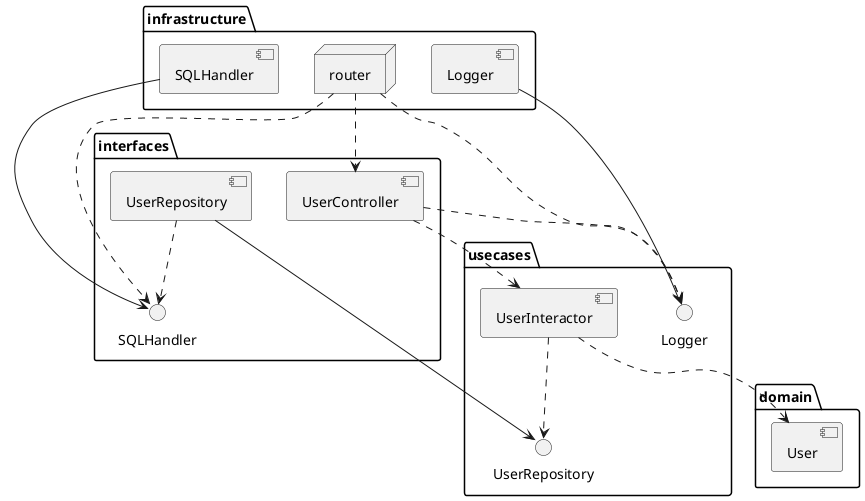
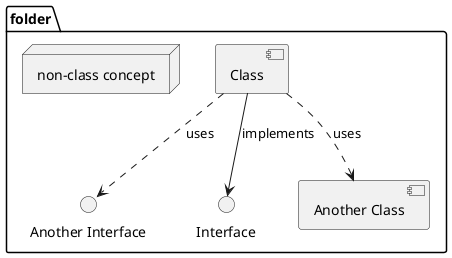
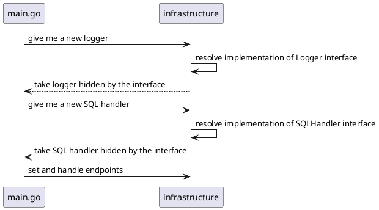

# Clean Architecture


The further in you go, the **higher level** the software becomes. The outer circles are **mechanisms**. The inner circles are **policies**.

## The Dependency Rule
This rule says that source code dependencies **can only point inwards.**

**We don’t want anything in an outer circle to impact the inner circles.**

What if an inner layer needs to use a concept implemented in an outer layer? Then we **declare an interface in the inner layer** (see [DIP](http://en.wikipedia.org/wiki/Dependency_inversion_principle)).

## Example
Let's download an example:

```bash 
git clone https://github.com/bmf-san/go-clean-architecture-web-application-boilerplate
```

Let's go inside the `app` folder.

All layer-related code is inside the same folder, as follows:

| Layer | Folder |
|-------|--------|
| Frameworks & Drivers | infrastructure |
| Interface Adapters | interfaces |
| Use Cases | usecases |
| Entities | domain |

### Layers Interaction



#### Legend



### Sequence Diagram




## References
[https://blog.cleancoder.com/uncle-bob/2012/08/13/the-clean-architecture.html](https://blog.cleancoder.com/uncle-bob/2012/08/13/the-clean-architecture.html)

[https://dev.to/bmf_san/dive-to-clean-architecture-with-golang-cd4](https://dev.to/bmf_san/dive-to-clean-architecture-with-golang-cd4)